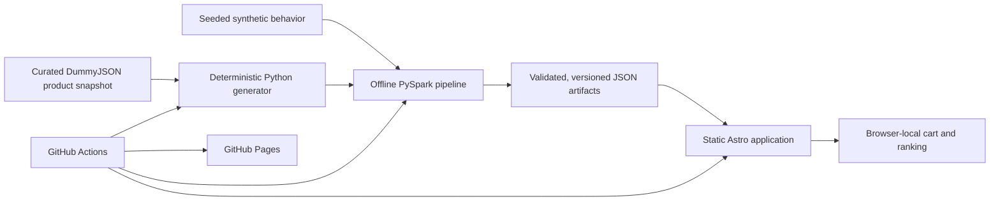
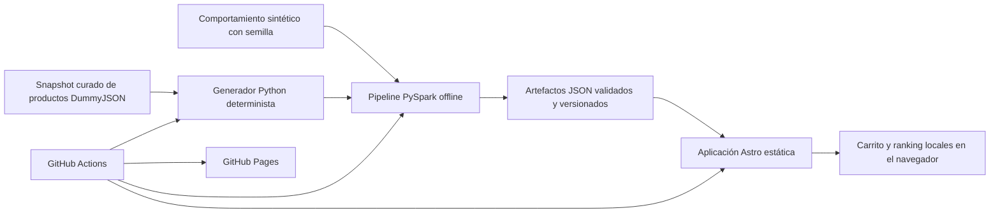

# Retail Recommendation Lab

[English](#english) · [Español](#español) · [Live demo](https://sebastiangaray.github.io/retail-recommendation-lab/)

## English

Retail Recommendation Lab is a bilingual, interactive portfolio project that makes an offline recommendation system observable from end to end. Visitors can browse a fictional catalog, build a local cart, compare five recommendation strategies, inspect why each product was selected, and review synthetic offline evaluation metrics.

This is an educational technical demo, not a production store. It has no checkout, payments, accounts, backend, visitor tracking, or request-time model training.

### What it demonstrates

- Deterministic synthetic customer, session, and event generation.
- Explicit PySpark schemas, validation, quarantine rules, sessionization, and weighted interactions.
- Popularity, category popularity, frequently bought together, item similarity, and hybrid ranking.
- Chronological offline evaluation at K=3, 5, and 10 without training/evaluation leakage.
- Versioned, bounded JSON artifacts with checksums and dataset compatibility checks.
- A static Astro storefront with English and Spanish routes.
- Search, category filters, sorting, product details, cart quantities, persistence, and session reset.
- Explainable, cart-aware recommendations with deterministic fallbacks.
- Responsive and accessible light, dark, and system themes.
- GitHub Actions validation and deployment to GitHub Pages with no paid runtime infrastructure.

### Data sources

The project uses two clearly separated types of fictional data:

1. **Product presentation.** Eight product records were manually curated from the [DummyJSON Products API](https://dummyjson.com/docs/products). Names, categories, prices, stock, ratings, tags, and image URLs are pinned in `pipeline/src/retail_recommendation_lab/catalog.py`. English descriptions were condensed and Spanish copy was written for this demo. The build never calls DummyJSON, so catalog generation remains deterministic. Only product images are loaded from the DummyJSON CDN in the visitor's browser, with a CSS fallback if they fail.
2. **Shopping behavior.** Customer IDs, segments, preferences, sessions, views, cart actions, and purchases are generated locally from a fixed seed. They do not represent real people or real transactions. Raw events remain outside the public web build.

All prices, inventory, reviews, popularity scores, relationships, recommendations, and evaluation results must be interpreted as synthetic demo data.

### Architecture



`artifacts/demo` is the canonical artifact set. Identical public copies are written to `apps/web/public`. The browser consumes only bounded JSON files; Spark and Python never run in production.

More detail: [architecture](docs/architecture.md), [data contracts](docs/data-contracts.md), [evaluation](docs/evaluation.md), and [recommendation system card](docs/recommendation-system-card.md).

### Technology

- Python 3.12, uv, Pydantic, PyArrow, and PySpark 4.
- Astro 7, strict TypeScript, semantic HTML, and framework-free browser state.
- pytest, Ruff, Pyright, Vitest, Playwright, Prettier, and pre-commit.
- GitHub Actions and GitHub Pages.

### Requirements

- Git.
- Python 3.12 or newer.
- [uv](https://docs.astral.sh/uv/).
- Java 17 or newer for PySpark.
- Node.js 22.12 or newer and npm.
- GNU Make is optional; every command also has a direct equivalent.

On Windows, the storefront and Python tests run normally in PowerShell. For the complete local Spark pipeline, WSL/Linux is recommended; native Windows may additionally require compatible Hadoop `winutils.exe` configuration through `HADOOP_HOME`.

### Installation

```bash
git clone https://github.com/SebastianGaray/retail-recommendation-lab.git
cd retail-recommendation-lab
uv sync --project pipeline --locked --dev
npm ci
```

Ensure Java is available before running Spark:

```bash
java -version
```

If Java is installed but not detected, set `JAVA_HOME` to the JDK directory and add its `bin` directory to `PATH`.

### Run the storefront

```bash
npm run dev
```

Open the local URL shown by Astro and use either route:

- `/retail-recommendation-lab/en/`
- `/retail-recommendation-lab/es/`

The deployed application is available at:

https://sebastiangaray.github.io/retail-recommendation-lab/

### Generate and validate data

```bash
uv run --project pipeline generate-catalog
uv run --project pipeline validate-catalog
uv run --project pipeline run-pipeline
uv run --project pipeline validate-artifacts
```

Equivalent Make targets:

```bash
make generate
make pipeline
make validate-artifacts
```

The pipeline uses dataset version `small-2026-08-01` and seed `20260801`. Running it again must reproduce the committed small-profile artifacts exactly.

### Tests and quality checks

```bash
uv run --project pipeline ruff check pipeline
uv run --project pipeline ruff format --check pipeline
uv run --project pipeline pyright --project pipeline/pyrightconfig.json
uv run --project pipeline pytest

npm run lint
npm run typecheck
npm test
npx playwright install chromium
npm run build
npm run test:e2e

uv run --project pipeline pre-commit run --all-files
```

Playwright runs against the production preview using the real `/retail-recommendation-lab` base path and includes desktop and mobile flows.

### Repository structure

```text
apps/web/         Static Astro application and public artifact copies
artifacts/demo/   Canonical generated recommendation artifacts
data/             Local raw/processed pipeline data; raw events are not published
docs/             Architecture, contracts, evaluation, decisions, and UX notes
pipeline/         Python package, PySpark pipeline, and tests
```

### Privacy, cost, and limitations

- No personal or real customer data is used.
- Cart state stays in the browser's `localStorage`.
- There are no analytics, cookies for tracking, authentication, or secrets in the web app.
- The deployed site requires no database, Spark cluster, Python service, or paid API.
- The catalog and evaluation population are deliberately small.
- Offline metrics describe generated behavior only and are not production-performance claims.
- Product images depend on the external DummyJSON CDN but have a local visual fallback.
- Recommendations update only when versioned artifacts are regenerated and deployed.

### License and attribution

This repository currently has **no project-level `LICENSE` file**. Copyright remains with the repository owner, and public availability alone does not grant permission to copy, modify, or redistribute the project. Add an explicit license before treating it as open-source software.

DummyJSON's source project is distributed under the [MIT License](https://github.com/Ovi/DummyJSON/blob/master/LICENSE) and is used here as a fictional product-data source for a technical demo. Product records are attributed to [DummyJSON](https://dummyjson.com/). Third-party dependencies and externally hosted assets remain subject to their respective licenses and terms.

---

## Español

Retail Recommendation Lab es un proyecto de portafolio bilingüe e interactivo que permite observar de principio a fin un sistema de recomendaciones offline. Las personas pueden explorar un catálogo ficticio, armar un carrito local, comparar cinco estrategias, entender por qué se eligió cada producto y revisar métricas sintéticas de evaluación offline.

Es una demostración técnica educativa, no una tienda de producción. No incluye checkout, pagos, cuentas, backend, seguimiento de visitantes ni entrenamiento del modelo durante una solicitud.

### Qué demuestra

- Generación determinista de clientes, sesiones y eventos sintéticos.
- Esquemas explícitos de PySpark, validación, cuarentena, sesiones e interacciones ponderadas.
- Popularidad global, popularidad por categoría, productos comprados juntos, similitud de productos y ranking híbrido.
- Evaluación cronológica offline en K=3, 5 y 10, sin filtraciones entre entrenamiento y evaluación.
- Artefactos JSON versionados y acotados, con checksums y compatibilidad de dataset.
- Una tienda estática en Astro con rutas en inglés y español.
- Búsqueda, filtros, ordenamiento, detalle de producto, cantidades, persistencia del carrito y reinicio de sesión.
- Recomendaciones explicables basadas en el carrito y fallbacks deterministas.
- Temas claro, oscuro y del sistema, con diseño responsive y accesible.
- Validación en GitHub Actions y despliegue en GitHub Pages sin infraestructura pagada en runtime.

### Origen de los datos

El proyecto utiliza dos tipos de datos ficticios claramente separados:

1. **Presentación de productos.** Se seleccionaron manualmente ocho registros de la [API de productos de DummyJSON](https://dummyjson.com/docs/products). Los nombres, categorías, precios, stock, calificaciones, etiquetas y URLs de imágenes están fijados en `pipeline/src/retail_recommendation_lab/catalog.py`. Las descripciones en inglés fueron resumidas y el contenido en español fue redactado para esta demostración. El build nunca consulta DummyJSON, por lo que la generación sigue siendo determinista. Solo las imágenes se cargan desde el CDN de DummyJSON en el navegador, con un fallback CSS si fallan.
2. **Comportamiento de compra.** Los identificadores de clientes, segmentos, preferencias, sesiones, vistas, acciones de carrito y compras se generan localmente con una semilla fija. No representan personas ni transacciones reales. Los eventos crudos no forman parte del build público.

Todos los precios, inventario, reseñas, puntajes de popularidad, relaciones, recomendaciones y resultados de evaluación deben interpretarse como datos sintéticos de demostración.

### Arquitectura



`artifacts/demo` contiene los artefactos canónicos. Se generan copias públicas idénticas en `apps/web/public`. El navegador consume solamente archivos JSON acotados; Spark y Python nunca se ejecutan en producción.

Más información: [arquitectura](docs/architecture.md), [contratos de datos](docs/data-contracts.md), [evaluación](docs/evaluation.md) y [ficha del sistema de recomendaciones](docs/recommendation-system-card.md).

### Tecnologías

- Python 3.12, uv, Pydantic, PyArrow y PySpark 4.
- Astro 7, TypeScript estricto, HTML semántico y estado del navegador sin frameworks.
- pytest, Ruff, Pyright, Vitest, Playwright, Prettier y pre-commit.
- GitHub Actions y GitHub Pages.

### Requisitos

- Git.
- Python 3.12 o superior.
- [uv](https://docs.astral.sh/uv/).
- Java 17 o superior para PySpark.
- Node.js 22.12 o superior y npm.
- GNU Make es opcional; todos los comandos tienen un equivalente directo.

En Windows, la aplicación web y las pruebas Python funcionan normalmente desde PowerShell. Para ejecutar todo el pipeline Spark localmente se recomienda WSL/Linux; una instalación nativa de Windows puede necesitar además una versión compatible de Hadoop `winutils.exe` configurada mediante `HADOOP_HOME`.

### Instalación

```bash
git clone https://github.com/SebastianGaray/retail-recommendation-lab.git
cd retail-recommendation-lab
uv sync --project pipeline --locked --dev
npm ci
```

Comprueba que Java esté disponible antes de ejecutar Spark:

```bash
java -version
```

Si Java está instalado pero no se detecta, define `JAVA_HOME` con la ruta del JDK y agrega su directorio `bin` a `PATH`.

### Ejecutar la aplicación

```bash
npm run dev
```

Abre la URL local indicada por Astro y utiliza cualquiera de estas rutas:

- `/retail-recommendation-lab/en/`
- `/retail-recommendation-lab/es/`

La versión publicada está disponible en:

https://sebastiangaray.github.io/retail-recommendation-lab/

### Generar y validar los datos

```bash
uv run --project pipeline generate-catalog
uv run --project pipeline validate-catalog
uv run --project pipeline run-pipeline
uv run --project pipeline validate-artifacts
```

Comandos equivalentes con Make:

```bash
make generate
make pipeline
make validate-artifacts
```

El pipeline utiliza la versión de dataset `small-2026-08-01` y la semilla `20260801`. Al ejecutarlo nuevamente debe reproducir exactamente los artefactos del perfil pequeño incluidos en el repositorio.

### Pruebas y controles de calidad

```bash
uv run --project pipeline ruff check pipeline
uv run --project pipeline ruff format --check pipeline
uv run --project pipeline pyright --project pipeline/pyrightconfig.json
uv run --project pipeline pytest

npm run lint
npm run typecheck
npm test
npx playwright install chromium
npm run build
npm run test:e2e

uv run --project pipeline pre-commit run --all-files
```

Playwright utiliza el preview de producción con la ruta base real `/retail-recommendation-lab` e incluye flujos de escritorio y móvil.

### Estructura del repositorio

```text
apps/web/         Aplicación Astro estática y copias públicas de artefactos
artifacts/demo/   Artefactos canónicos generados por el recomendador
data/             Datos locales del pipeline; los eventos crudos no se publican
docs/             Arquitectura, contratos, evaluación, decisiones y notas UX
pipeline/         Paquete Python, pipeline PySpark y pruebas
```

### Privacidad, costo y limitaciones

- No se utilizan datos personales ni clientes reales.
- El carrito permanece en `localStorage` dentro del navegador.
- La aplicación no contiene analítica, cookies de seguimiento, autenticación ni secretos.
- El sitio publicado no requiere base de datos, clúster Spark, servicio Python ni API pagada.
- El catálogo y la población de evaluación son deliberadamente pequeños.
- Las métricas offline describen comportamiento generado; no son afirmaciones de rendimiento en producción.
- Las imágenes dependen del CDN externo de DummyJSON, pero cuentan con un fallback visual local.
- Las recomendaciones cambian únicamente cuando se regeneran y despliegan los artefactos versionados.

### Licencia y atribución

Este repositorio **no contiene actualmente un archivo `LICENSE` propio**. Los derechos de autor permanecen con el propietario y el hecho de que el código sea visible públicamente no concede permiso para copiarlo, modificarlo o redistribuirlo. Se debe agregar una licencia explícita antes de considerar el proyecto como software de código abierto.

El proyecto fuente de DummyJSON se distribuye bajo la [licencia MIT](https://github.com/Ovi/DummyJSON/blob/master/LICENSE) y aquí se utiliza como fuente ficticia de productos para una demostración técnica. Los registros se atribuyen a [DummyJSON](https://dummyjson.com/). Las dependencias y recursos externos conservan sus respectivas licencias y condiciones.
