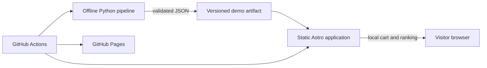

# Architecture

## System context

Retail Recommendation Lab has two execution environments: an offline Python pipeline and a static browser application. The artifact between them is the explicit integration boundary.

## Offline pipeline

The deterministic generator creates fictional customers, sessions, and behavior without personal data. PySpark reads explicit-schema Parquet, validates and quarantines rows, sessionizes with windows, aggregates weighted interactions, and exports popularity, category, co-purchase, and cosine-style item similarity results. A UTC training cutoff prevents later evaluation events from influencing artifacts.

Evaluation reconstructs pre-cutoff customer context and scores held-out purchases after the cutoff. Candidate strategies implement a common interface. The hybrid normalizes popularity, category, basket, similarity, and novelty signals; inventory/cart/category rules are applied separately after model scoring.

## Artifact boundary

`artifacts/demo` is canonical. Every recommendation artifact carries schema/dataset versions and seed; the manifest records checksums, sizes, and counts. Identical copies are published under `apps/web/public`. Raw events are never public.

## Browser application

Astro emits static EN and ES routes. Plain TypeScript validates loaded data, persists quantity-aware cart state in `localStorage`, and consumes five compatible offline strategy artifacts while excluding unavailable and cart products. No user state leaves the device.

## Deployment and cost strategy

GitHub Actions runs locked checks, generates artifacts, and builds static output. GitHub Pages hosts it without a permanent server, managed database, paid API, authentication, or secrets. Product images use a fake image endpoint and degrade to a local CSS fallback.
