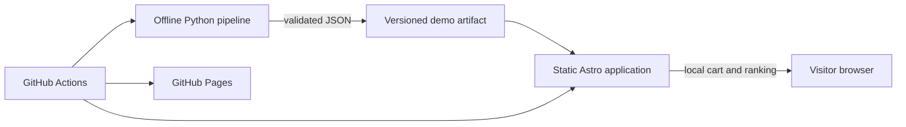

# Architecture

## System context

Retail Recommendation Lab has two execution environments: an offline Python pipeline and a static browser application. The artifact between them is the explicit integration boundary.

## Offline pipeline

The deterministic generator creates fictional products and validates every field with Pydantic. Future event generation, PySpark processing, model comparison, and evaluation remain offline; they will export browser-sized results through the same artifact boundary.

## Artifact boundary

`artifacts/demo/catalog.json` is canonical. Generation writes an identical copy to `apps/web/public/catalog.json`; validation fails if either the schema or copies diverge. This keeps deployment independent from Python and Spark.

## Browser application

Astro emits static EN and ES routes. Plain TypeScript validates loaded data, persists product IDs in `localStorage`, and ranks in-stock products by synthetic popularity while excluding cart items. No user state leaves the device.

## Deployment and cost strategy

GitHub Actions runs locked checks, generates artifacts, and builds static output. GitHub Pages hosts it without a permanent server, managed database, paid API, authentication, or secrets. Product images use a fake image endpoint and degrade to a local CSS fallback.
